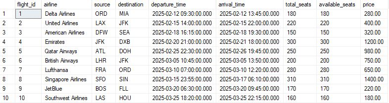
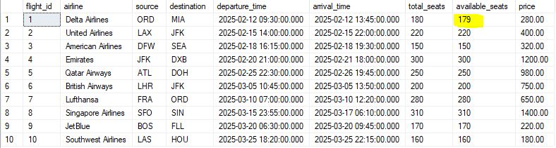
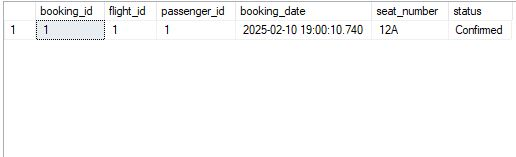
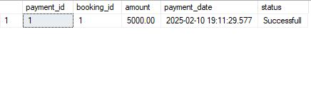
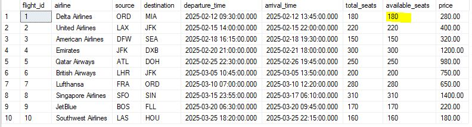
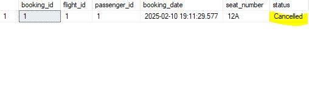

<h1>Tables Before and After running book a flight query</h1>

<h3>Before</h3>

<h5>Flights Table</h5>

<h5>Bookings Table is empty</h5>

<h3>After</h3>

<h5>Flights Table</h5>

<h5>Bookings Table</h5>

<h5>Payments Table</h5>

<h1>Tables after cancelling the flight</h1>

<h5>Flights Table</h5>

<h5>Bookings Table</h5>

